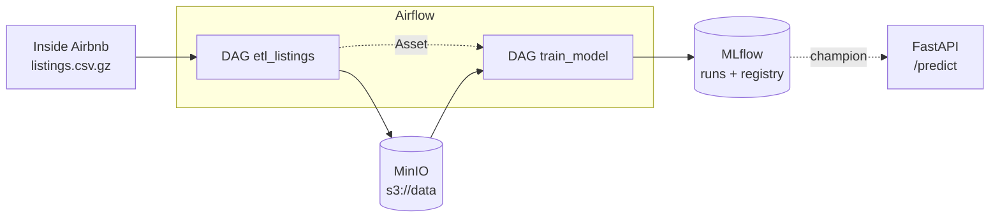
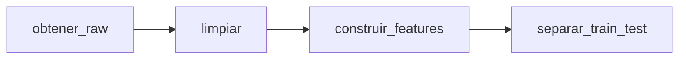
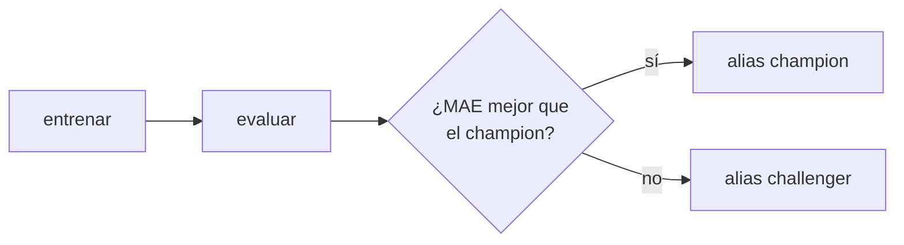

# Precio de Airbnb en Río de Janeiro, en producción
### MLOps1 (AMq2) - CEIA - FIUBA

Llevamos a un entorno productivo el modelo del TP final de Aprendizaje de Máquina I:
un **XGBoost que predice el precio por noche de un aviso de Airbnb en Río de Janeiro**,
con un **MAE de ~250 BRL** en test (el baseline heurístico daba 385).

El entorno simula la infraestructura de *ML Models and something more Inc.*: Airflow
orquesta, MLflow registra experimentos y modelos, MinIO hace de data lake S3,
PostgreSQL guarda metadatos y FastAPI sirve el modelo. Todo corre con Docker Compose,
sobre la base de [amq2-service-ml](https://github.com/facundolucianna/amq2-service-ml).

**Integrantes:** _completar_

## El modelo

- **Datos:** [Inside Airbnb](https://insideairbnb.com/get-the-data/), Río de Janeiro,
  scrape del 24/06/2026. 48.713 avisos y 90 columnas, que tras la limpieza quedan en 44.238.
- **Target:** precio por noche en BRL. El modelo entrena sobre `log(precio)` y devuelve BRL.
- **Features:** 35 (19 numéricas, 13 binarias, 3 categóricas). Lat/lon son las más importantes.
- **Modelo:** XGBoost con los hiperparámetros que encontró Optuna en el TP de AMq1.

| Métrica (test) | Valor |
| --- | --- |
| MAE | 249,6 BRL |
| RMSE | 613,2 BRL |
| MAPE | 31,4 % |
| R² | 0,545 |

El análisis completo y la comparación contra los otros 15 modelos están en el
[notebook del TP de AMq1](https://github.com/lautarovera-edu/fiuba-ceia-amq/tree/tp-full-run/trabajo_final).

**Limitación conocida:** el error tiene forma de U. Es del 46 % en el quintil más
barato, del 23 % en el medio y del 37 % en el más caro.

## Arquitectura



| Servicio | Rol en el TP | URL local |
| --- | --- | --- |
| Airflow | Corre los DAGs de ETL y entrenamiento | http://localhost:8080 (airflow / airflow) |
| MinIO | Data lake: CSV crudo, parquet intermedios, train/test, artefactos de MLflow | http://localhost:9001 (minio / minio123) |
| MLflow | Runs con parámetros y métricas, Model Registry con alias `champion` | http://localhost:5001 |
| PostgreSQL | Metadatos de Airflow y MLflow | `localhost:5432` |
| FastAPI | Sirve el modelo `champion` (entrega final) | http://localhost:8800/docs |

### DAG `etl_listings` (semanal)



| Task | Qué hace | Escribe |
| --- | --- | --- |
| `obtener_raw` | Baja el snapshot de Inside Airbnb, sólo si todavía no está | `s3://data/raw/listings.csv.gz` |
| `limpiar` | Saca columnas con fuga, parsea el precio y corta precios > 10.000 BRL | `s3://data/interim/listings_limpio.parquet` |
| `construir_features` | Banderas de faltantes, amenities, antigüedad del host | `s3://data/interim/listings_features.parquet` |
| `separar_train_test` | Split 70/30, semilla 42 | `s3://data/final/train.parquet`, `test.parquet` |

Cada task lee y escribe en MinIO, así que ninguna depende de lo que quedó en memoria
de otra y cualquiera se puede reintentar sola.

### DAG `train_model` (se dispara solo cuando cambia `train.parquet`)



1. `entrenar`: ajusta el pipeline y lo registra como nueva versión de `airbnb_rio_price`.
2. `evaluar`: calcula MAE, RMSE, MAPE y R² en test (en BRL) y los guarda en el run.
3. `promover`: si la versión nueva tiene mejor MAE que el `champion`, pasa a ser el
   `champion`. Si no, queda como `challenger` y producción no cambia.

`train_model` no tiene horario: está atado al Asset `s3://data/final/train.parquet`.
Cuando el ETL escribe datos nuevos, Airflow lo dispara solo.

## Estructura del repo

```
├── airflow/dags/
│   ├── etl_listings.py       # DAG de ETL
│   └── train_model.py        # DAG de entrenamiento + champion/challenger
├── src/airbnb_rio/           # paquete compartido por los DAGs (y la API en la final)
│   ├── config.py             # columnas, hiperparámetros, rutas S3, nombres de MLflow
│   ├── features.py           # limpieza y features (secciones 2-3 del TP de AMq1)
│   ├── modelo.py             # preprocesador + XGBoost + métricas
│   └── s3.py                 # lectura/escritura en MinIO
├── dockerfiles/              # imágenes de cada servicio
└── docker-compose.yaml
```

`src/` se monta en los contenedores de Airflow (`/opt/airflow/src`, en el
`PYTHONPATH`). La limpieza, las features y el pipeline existen en un solo lugar.

## Cómo levantarlo

Requisitos: Docker con **al menos 6 GB de RAM asignados** (Docker Desktop → Settings →
Resources). Con menos, los contenedores de Airflow se caen.

```bash
docker compose --profile all up -d --build
```

(Con Colima o instalaciones viejas el comando es `docker-compose`, con guion.)

Si el puerto 5432 ya está ocupado en tu máquina (otro Postgres), elegí otro:

```bash
PG_PORT=5433 docker compose --profile all up -d --build
```

Esperar a que `docker ps` muestre todo `healthy` (unos minutos la primera vez).

## Cómo correrlo

1. Entrar a Airflow (http://localhost:8080, `airflow` / `airflow`).
2. Activar (*unpause*) `etl_listings` y `train_model`. Arrancan pausados.
3. Disparar `etl_listings` con ▶. Al terminar, `train_model` arranca solo.
4. Ver el resultado en MLflow (http://localhost:5001): experimento `airbnb_rio_price`,
   y en *Models* la versión con alias `champion`.

Si Inside Airbnb no está accesible, se puede subir el CSV a mano antes del paso 3
(`obtener_raw` lo detecta y no descarga):

```bash
docker run --rm --network ceia-mlops1-tp_backend -v "$PWD":/w --entrypoint sh \
  coollabsio/minio:RELEASE.2025-04-22T22-12-26Z -c \
  "mc alias set s3 http://s3:9000 minio minio123 && mc cp /w/listings.csv.gz s3/data/raw/"
```

Apagar: `docker compose --profile all down`. Borrar todo, datos incluidos:
`docker compose down --rmi all --volumes`.

## Decisiones de diseño

1. **El preprocesamiento vive dentro del modelo.** Imputación, escalado, one-hot y la
   agrupación de categorías raras se serializan junto con XGBoost. La API recibe
   features y predice. Si el preprocesamiento viviera en dos lugares, tarde o temprano
   se desincronizarían y el modelo predeciría basura sin tirar error.
2. **El logaritmo del target no sale del modelo.** `TransformedTargetRegressor` entrena
   sobre `log(precio)` y aplica `exp()` al predecir, así el artefacto devuelve BRL.
   Olvidarse el `exp()` en la API es el bug más probable de este TP.
3. **Categorías raras con `min_frequency`.** En el notebook, los barrios con menos de
   200 avisos se pasaban a mano a "Otros". Ahora lo hace el `OneHotEncoder`
   (`min_frequency=200`, `handle_unknown="infrequent_if_exist"`): queda ajustado sobre
   train y un barrio nunca visto cae en "Otros" en vez de romper. Por esa diferencia el
   MAE pasó de 250,5 a 249,6.
4. **Snapshot fijo de datos.** Inside Airbnb re-scrapea seguido: entre marzo y junio los
   faltantes de `bedrooms` pasaron de 123 a 6.446. La URL apunta a una fecha fija para
   que los números sean reproducibles.
5. **Sólo XGBoost.** Los otros 15 modelos del TP quedan en el notebook como evidencia.
   SVR solo tardaba 107 minutos. Los hiperparámetros de Optuna están en
   `src/airbnb_rio/config.py`.

## Estado

**Primera entrega**
- [x] Servicios de base en Docker Compose
- [x] Paquete `src/airbnb_rio` con la limpieza, las features y el pipeline del TP de AMq1
- [x] DAG `etl_listings`: CSV crudo → parquet de train/test en MinIO
- [x] DAG `train_model`: entrenamiento, registro en MLflow y champion/challenger

**Entrega final**
- [ ] Experimento de búsqueda de hiperparámetros en MLflow (Optuna, un run anidado por trial)
- [ ] API: `POST /predict` que devuelve BRL, cargando el `champion` del registry
- [ ] Log de predicciones en PostgreSQL
- [ ] Documentación de la API (`/docs`) acorde al modelo

## Más sobre el entorno

Detalles de la infraestructura base (variables de Airflow, conexiones, CLI, acceso a
los buckets desde afuera de Docker) en el
[README original de la cátedra](https://github.com/facundolucianna/amq2-service-ml#readme).
